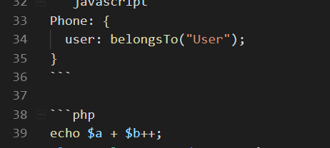

# 数据库结构目录

## 用户表{docsify-ignore}

| 字段名 | 描述     |
| ------ | -------- |
| id     | 用户编号 |

## 用户表 9

表描述

| 字段名 | 描述     | 我爱喝同？？ |
| ------ | -------- | ------------ |
| id     | 用户编号 | fdsafsda     |
| id     | 用户编号 | fdsafsda     |
| id     | 用户编号 | fdsafsda     |



这是一句话，这是一行代码`echo "hello world!";` , `a` `aa`, **fsd**

> 引用你麻痹

!> bianhong

?> bianlan

[外部鏈接](https://www.baidu.com)

```关联关系
User:{
    phones:hasMany('Phone')
}

```

## 用户表 8

| 字段名 | 描述     |
| ------ | -------- |
| id     | 用户编号 |

```javascript
Phone: {
  user: belongsTo("User");
}
```

```php
echo $a + $b++;
class AClass extends BCLass{
    public static $c = 3;
    private function printC(){
        return $c;
    }
}
```

## 用户表 7

| 字段名 | 描述     |
| ------ | -------- |
| id     | 用户编号 |

## 用户表 6

| 字段名 | 描述     |
| ------ | -------- |
| id     | 用户编号 |

## 用户表 5

| 字段名 | 描述     |
| ------ | -------- |
| id     | 用户编号 |

## 用户表 3

| 字段名 | 描述     |
| ------ | -------- |
| id     | 用户编号 |

## 用户表 2

| 字段名 | 描述     |
| ------ | -------- |
| id     | 用户编号 |

## 用户表 4

| 字段名 | 描述     |
| ------ | -------- |
| id     | 用户编号 |
